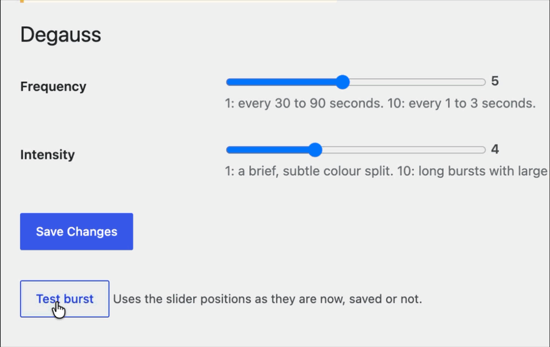
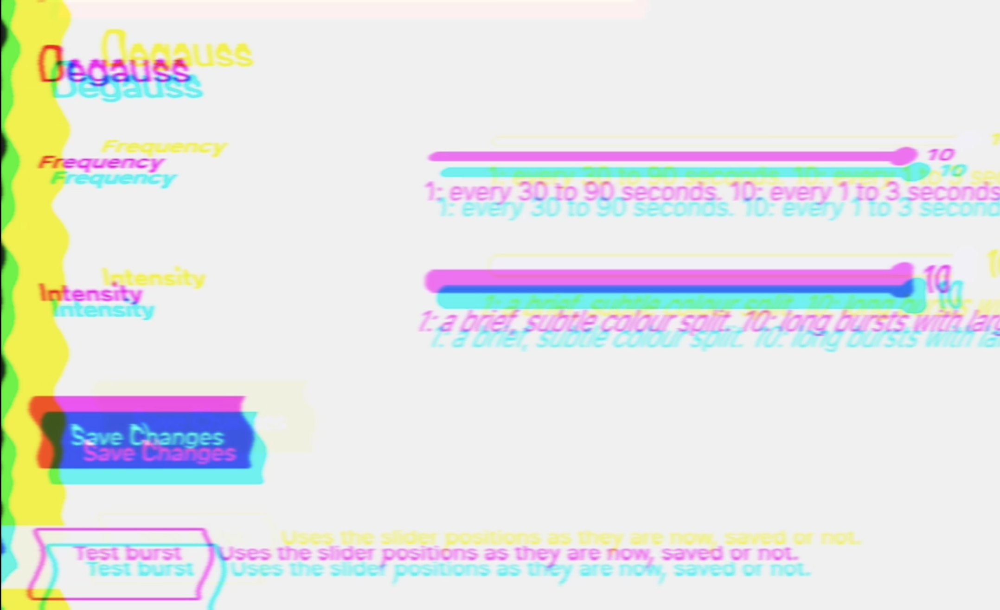

# Degauss

Add a retro "degauss" effect to every page on your site. Make it subtle enough and your site visitors will question reality. Because why not.





## Settings

Two levels, each 1 (least) to 10 (most). Every burst is still randomised within its level.

| Level       | 1                                  | 10                                                          |
|-------------|------------------------------------|-------------------------------------------------------------|
| `frequency` | a burst every 30 to 90 seconds     | a burst every 1 to 3 seconds                                |
| `intensity` | about 180ms, offsets up to 6px     | up to about 1s, offsets up to 40px, vertical drift, smearing and line tearing |

## As a WordPress plugin

Copy this folder to `wp-content/plugins/degauss` and activate. Set the levels under Settings > Degauss; the
"Test burst" button there fires one using the current slider positions. The script is enqueued deferred in
the footer on the front end only.

The `degauss_config` filter can override the saved levels per request. Return `false` to skip the script:

```php
add_filter( 'degauss_config', 'my_degauss_config' );
function my_degauss_config( $config ) {
	if ( is_page( 'contact' ) ) {
		return false;
	}
	$config['intensity'] = 7;
	return $config;
}
```

## As a standalone script

```html
<script src="degauss.js" data-frequency="3" data-intensity="4" defer></script>
```

Or set `window.DegaussConfig = { frequency: 3, intensity: 4 }` before the script tag. Data attributes win over
the global. Omitted levels default to 1. Set `autostart` to `0` to load without starting the timer.

## Console

`Degauss.fire()` runs a burst now. `Degauss.stop()` cancels the timer. `Degauss.start()` resumes it.
`Degauss.config` holds the live levels; changes to it take effect on the next burst.
